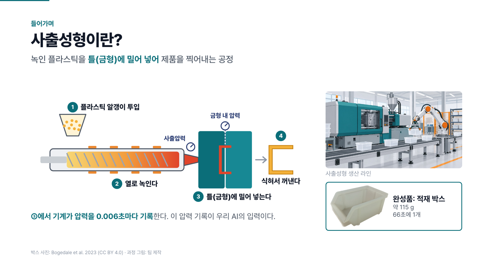
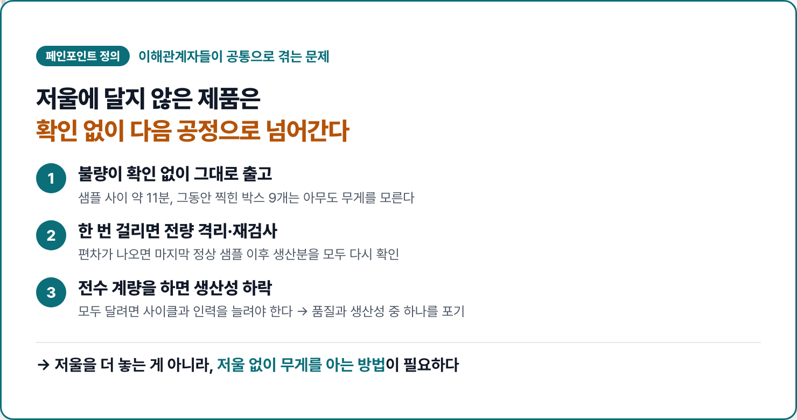
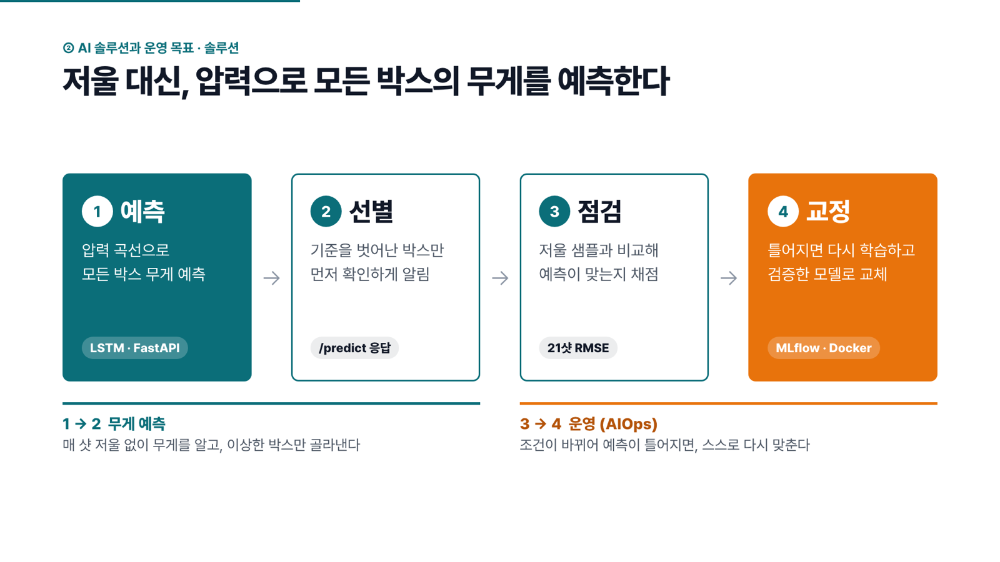
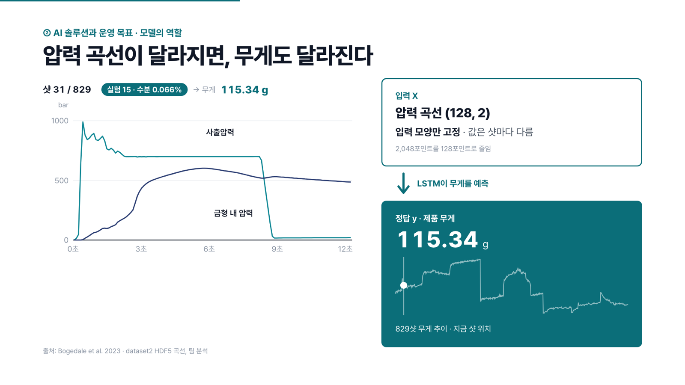
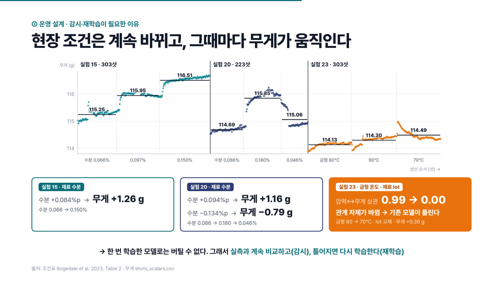
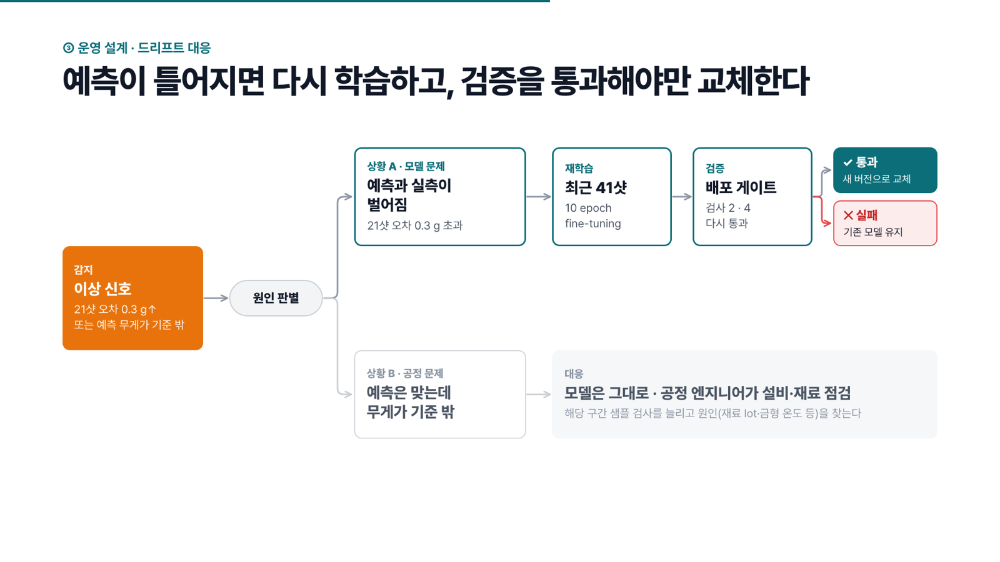
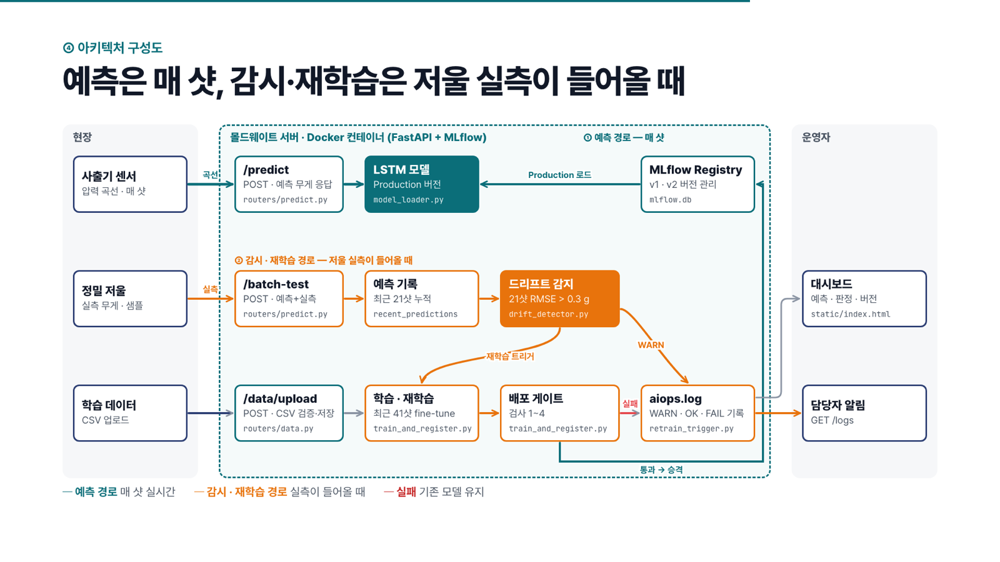
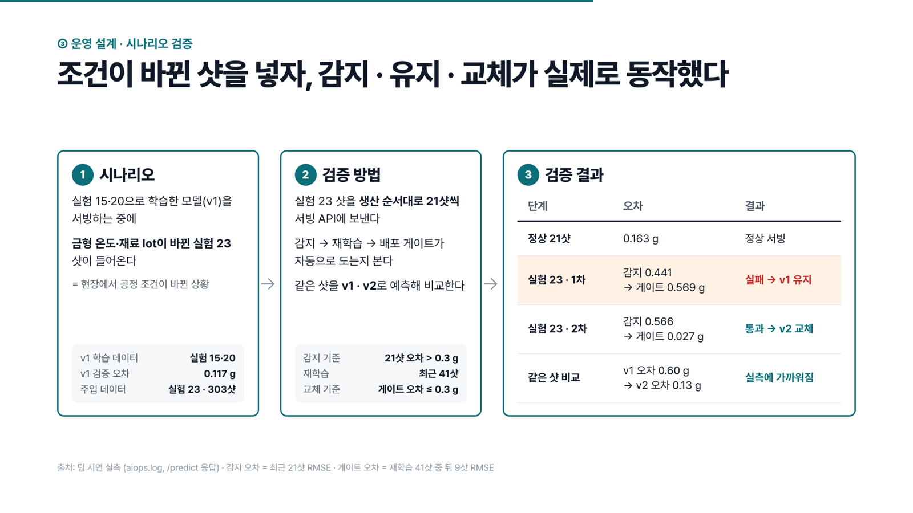
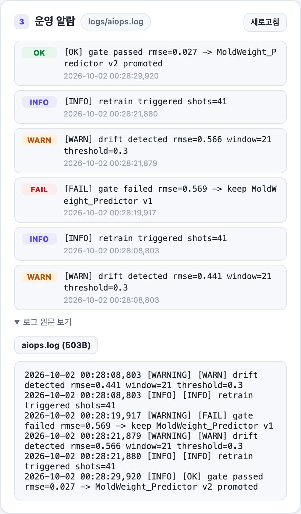

# MoldWeight

사출성형 기계가 매 샷 기록하는 압력 곡선으로 제품 무게를 예측하고, 공정 조건이 바뀌어 예측이 틀어지면 스스로 다시 학습하는 서비스입니다. SKALA 모델 서빙·AIOps 과정 판교 6반 4조 팀 프로젝트입니다.

**압력 곡선 → 무게 예측 → 실측 비교 → 드리프트 감지 → 재학습 → 성능 게이트 → Production 전환**

| 무엇을 | 결과 |
|---|---|
| 예측 정확도 | 검증 RMSE **0.117 g** (박스 무게 약 115 g), 평균값만 답하는 기준 모델(0.901 g)보다 87% 정확 |
| 응답 속도 | `/predict` p95 **44.6 ms** (사출 한 사이클은 약 66초) |
| 드리프트 대응 | 조건이 바뀐 실제 샷을 넣자 감지 → 재학습 → 게이트 실패 시 기존 모델 유지 → 통과 시 새 모델로 교체까지 자동으로 동작 |

## 프로젝트 소개

### 사출성형과 압력 데이터

사출성형은 플라스틱 알갱이를 녹여 금형(틀)에 밀어 넣고 식혀서 꺼내는 공정입니다. 녹은 플라스틱을 밀어 넣는 동안 기계는 사출압력과 금형 내 압력을 0.006초마다 기록합니다. 이 압력 기록이 모델의 입력입니다.



### 해결하려는 문제

제품 무게는 금형이 제대로 채워졌는지 보여주는 핵심 품질 지표입니다. 하지만 매 샷을 저울에 달면 사이클과 인력이 늘어나서, 공장은 일부 샘플만 계량합니다. 그 사이에 찍힌 제품은 무게를 모른 채 다음 공정으로 넘어갑니다.



### 솔루션

저울 대신 압력 곡선으로 모든 제품의 무게를 예측하고, 저울로 단 샘플과 비교해 예측이 맞는지 계속 채점합니다. 오차가 커지면 최근 데이터로 다시 학습하고, 검증을 통과한 모델만 서비스에 올립니다.



### 모델의 입력과 출력

입력은 한 샷의 압력 곡선 `(128, 2)`입니다. 앞의 128은 **시간 축 포인트 수**입니다. 12.3초 동안 2,048번 기록된 값을 16개씩 평균내 약 0.1초 간격의 128개 시점으로 줄였습니다. 뒤의 2는 **채널 수**로, 같은 시점의 사출압력과 금형 내 압력(단위 bar) 두 값입니다. 즉 "128개 시점 × 시점마다 압력 2개"이고, 모양은 고정이며 값은 샷마다 달라집니다. 출력은 같은 샷의 무게(g)입니다.

미래 값을 맞히는 예측이 아니라, 방금 끝난 샷의 무게를 저울 없이 추정하는 회귀 모델입니다. LSTM은 이 128개 시점을 순서대로 읽습니다.



### 감시와 재학습이 필요한 이유

재료 수분, 재료 lot, 금형 온도가 바뀌면 무게도 움직입니다. 실험 15·20처럼 수분만 바뀐 구간은 모델이 따라가지만, 실험 23에서는 금형 온도와 재료 lot이 바뀌면서 압력과 무게의 관계 자체가 달라집니다(상관 0.99 → 0.00). 한 번 학습한 모델로는 버틸 수 없어서, 실측과 계속 비교하고 틀어지면 다시 학습합니다.



예측과 실측이 벌어지면 모델 문제로 보고 재학습하고, 예측은 맞는데 무게가 기준 밖이면 공정 문제로 보고 공정 엔지니어에게 넘깁니다. 재학습한 모델은 배포 게이트를 다시 통과해야만 교체됩니다.



### 아키텍처

예측 경로는 매 샷 돌고, 감시·재학습 경로는 저울 실측이 들어올 때 돕니다. 학습과 서빙은 같은 컨테이너에서 MLflow Registry를 공유합니다.



### 시나리오 검증

실험 15·20으로 학습한 v1을 서빙하는 중에 조건이 바뀐 실험 23 샷을 생산 순서대로 넣었습니다. 1차 재학습은 게이트에서 떨어져 v1을 유지했고, 2차 재학습은 통과해 v2로 교체됐습니다. 같은 샷의 예측 오차는 0.60 g에서 0.13 g으로 줄었습니다.





## 실행

모든 명령은 저장소 루트에서 실행합니다. Docker Compose 또는 Python 3.11을 사용합니다.

### Docker Compose

실제 모델을 학습하고 MLflow Production 모델로 서버를 실행합니다.

```bash
MOLDWEIGHT_BUILD_TARGET=trained MODEL_SOURCE=mlflow LOADING_MODE=eager \
  docker compose -f serving_app/docker-compose.yml up --build -d --wait
```

- [대시보드](http://localhost:8000/)
- [Swagger API 문서](http://localhost:8000/docs)
- [서버·모델 상태](http://localhost:8000/health)

`trained` 빌드는 스케일러 준비와 200 epoch 학습·성능 게이트를 수행합니다. 정상 예측에는 `/health`의 `model_loaded=true`가 필요합니다. Compose 기본값인 `runtime/local/lazy`는 모델 학습 없이 서버 기동을 확인하는 설정이므로, 실제 예측에는 위 환경변수를 함께 지정합니다.

포트를 변경하려면 기동 명령에 `MOLDWEIGHT_PORT=18082` 등을 추가합니다. 업로드 파일·로그·MLflow 기록은 컨테이너 안에 저장됩니다. `restart`는 상태를 유지하고, 컨테이너를 재생성하면 이미지의 초기 상태로 돌아갑니다.

### 로컬 Python

```bash
python3.11 -m venv .venv
source .venv/bin/activate
pip install -r requirements.txt

python scripts/train_baseline_v1.py --scaler-only
export MLFLOW_TRACKING_URI=sqlite:///mlflow.db
python serving_app/train_and_register.py

MODEL_SOURCE=mlflow LOADING_MODE=eager \
  uvicorn serving_app.main:app --host 127.0.0.1 --port 8000
```

최초 준비 명령은 스케일러를 다시 저장하므로 기존 모델 운영 중에는 재실행하지 않습니다. 서빙과 fine-tune은 저장된 스케일러를 재사용합니다. 로컬 파일 모델을 사용하려면 `python scripts/train_baseline_v1.py`로 모델을 생성한 뒤 `MODEL_SOURCE=local`로 실행합니다. Production 기반 재학습 시연에는 MLflow 모델이 필요합니다.

## 대시보드 시연

1. 새 `trained` 서버에서 대시보드를 엽니다. 정상·공정 변경 CSV는 자동으로 로드됩니다.
2. **정상 생산 → 라인 가동**을 선택합니다. 2샷마다 한 번 실측하며, 42샷 진행 후 실측 21건으로 정상 여부를 판정합니다.
3. 라인을 중지하고 **공정 조건이 바뀜 → 라인 가동**을 선택합니다. 기본 시작 샷은 `21101`이며 `21135`부터 금형온도 70°C 구간입니다.
4. 분기점에서 멈추면 드리프트·게이트 결과를 확인하고 **계속**을 누릅니다. 드리프트 후에는 전수검사로 전환하고, Production 전환 후 다시 계속하면 2샷마다 검사하는 모드로 돌아갑니다.

**처음부터**는 화면의 샷 진행과 표시를 초기화합니다. 모델과 서버의 판정 상태까지 초기화하려면 컨테이너를 재생성합니다.

학습 결과와 누적 샷에 따라 판정 위치와 승격 결과는 달라질 수 있습니다. **21샷 묶음 전송 · 다른 파일 사용 · 응답 JSON**에서 배치 전송과 파일 선택을 사용할 수 있습니다. 파일 선택은 브라우저에서 시연 데이터를 읽는 동작이며, 서버 업로드와 학습은 별도입니다.

CLI 시연은 다음 명령으로 실행합니다.

```bash
python scripts/simulate_drift.py --url http://127.0.0.1:8000 \
  --drift-start 21122 --max-drift-batches 2
```

## 데이터와 모델

| 항목 | 내용 |
|---|---|
| 입력 | 한 샷의 128×2 압력 곡선, 채널 순서 `[inj, cav]`, 허용 범위 −100~1500 bar |
| 출력 | 성형품 무게(g) |
| 학습 데이터 | `data/sample_moldweight.csv`: 실험 15·20, 526샷 |
| 드리프트 시연 데이터 | `data/drift_shots_23.csv`: 실험 23, 303샷 |
| 전처리 | `scripts/preprocess_hdf5.py`: 2,048포인트를 16개씩 평균하여 128포인트로 변환 |
| 모델·스케일러 | LSTM 32유닛 + Dense 1, 학습 데이터로 fit한 `CurveScaler`를 검증·서빙·재학습에서 재사용 |
| 학습 | 실험별 시간순 80/20 분할, 학습 420샷·검증 106샷, 200 epoch |
| fine-tune | Production 가중치에서 시작, 최근 41샷 중 앞 32샷 학습·뒤 9샷 평가, 10 epoch |
| 배포 게이트 | RMSE ≤ 0.3g, 첫 배포는 평균 예측 대비 50% 이상 개선, 이후 기존 모델의 같은 평가셋 RMSE + 0.05g 이내 |

게이트는 NaN·무한대 RMSE를 거부합니다. 통과하면 기존 버전을 Archived로 전환하고 새 버전을 Production으로 올립니다. 설정값은 [serving_app/config.py](serving_app/config.py), 학습·평가 기준은 [RULES.md](RULES.md)를 참고합니다.

CSV 필수 컬럼은 `cycle_counter, weight, inj_000~inj_127, cav_000~cav_127`이며 `experiment`는 선택 컬럼입니다. `experiment`는 모델 입력에 사용하지 않습니다. 업로드는 UTF-8(BOM 포함), 최소 41행, 유한한 무게와 허용 범위의 압력값을 요구합니다. 업로드는 파일 검증·저장만 수행하며 모델 학습이나 전환을 실행하지 않습니다.

## API

| 메서드 | 경로 | 요청·응답 |
|---|---|---|
| POST | `/predict` | `curve` 128×2 → `predicted_weight`, `model_version` |
| POST | `/predict/batch-test` | `shots`(cycle_counter·curve·actual_weight) → `predictions`, `drift_check` |
| GET | `/health` | `status`, `model_loaded`, `loading_mode` |
| POST | `/data/upload` | multipart CSV → `filename`, `rows` |
| GET | `/data/status` | 최근 업로드 파일의 행 수·샷 범위·무게 범위 |
| GET | `/logs` | 로그 파일 목록 |
| GET | `/logs/{filename}` | 로그 내용 |

`model_version`은 Registry 버전 번호 문자열(`"1"`, `"2"` 등)이며 로컬 모델이면 `"local"`입니다. 단일 `/predict`에는 실측 무게가 없으므로 드리프트 누적은 `/predict/batch-test`에서 수행합니다. 잘못된 곡선·빈 `shots`는 422, 잘못된 업로드 CSV는 400을 반환합니다. 상세 스키마와 요청 예시는 [Swagger](http://localhost:8000/docs)에서 확인합니다.

## 검증

모델 로딩, 정상 예측, 잘못된 곡선 거부를 확인하고 단일 예측의 warm p95를 측정합니다.

```bash
docker compose -f serving_app/docker-compose.yml exec -T \
  -e P95_SAMPLES=100 serving-app bash scripts/smoke_test.sh
```

p95는 첫 모델 로딩·학습 시간을 제외한 100회 순차 요청의 응답 시간입니다. 위 명령은 컨테이너 내부에서 측정합니다. 호스트에서 측정하려면 `BASE_URL=http://127.0.0.1:8000 P95_SAMPLES=100 bash scripts/smoke_test.sh`를 사용합니다.

업로드·드리프트·재학습·실제 서빙 버전 전환까지 확인하려면 새 `trained` 테스트 서버에서 실행합니다. 이 검증은 업로드 파일, 샷 버퍼, Production 모델 버전을 변경합니다.

```bash
docker compose -f serving_app/docker-compose.yml exec -T \
  -e INTEGRATION_TEST=1 serving-app bash scripts/smoke_test.sh
```

## CI

GitHub Actions는 `main` 대상 PR과 `main` push에서 정적 검사를 수행하고, 변경 범위에 따라 Docker 검증을 선택합니다.

| 변경 범위 | 검증 |
|---|---|
| README·RULES·AGENTS·LICENSE 또는 `docs/*.md`만 변경 | 정적 검사 |
| `serving_app/static/`만 변경하거나 문서와 함께 변경 | 정적 검사 + runtime |
| 모델·데이터·백엔드·의존성·Docker·CI·그 외 파일 | 정적 검사 + runtime/trained |

`runtime`은 서버 기동과 엔드포인트·의존성을, `trained`는 실제 학습·게이트·모델 로딩·smoke·p95·상태 전환을 검증합니다. 두 Docker 검증은 정적 검사 이후 병렬로 실행됩니다. 수동 실행이나 변경 범위를 확인할 수 없는 경우에는 전체 검증을 수행합니다.

의존성과 모델 학습 캐시를 분리해 화면·API 라우터·검증 스크립트 변경 시 학습 캐시를 재사용합니다. 최초 빌드나 학습 입력·모델 코드·설정 변경에는 의존성 설치 또는 재학습 시간이 필요합니다. 실행 결과는 [Actions](https://github.com/edder773/moldweight/actions)에서 확인합니다.

## 협업과 데이터 이용

담당 파일과 팀 규칙은 [RULES.md](RULES.md)를 따르며, `main`에는 PR로 반영합니다. 원본 HDF5, 실행 로그, MLflow 기록, 가상환경, 학습된 `.keras` 모델은 커밋하지 않습니다.

Bogedale, L.; Doerfel, S.; Schrodt, A.; Heim, H.-P. *Online Prediction of Molded Part Quality in the Injection Molding Process Using High-Resolution Time Series.* Polymers 2023, 15, 978. [논문](https://doi.org/10.3390/polym15040978) (CC BY 4.0).

CSV는 원본 압력 곡선을 평균 다운샘플링한 파생 데이터입니다. 원본 HDF5는 Git에 포함하지 않으며 전처리 스크립트와 파생 CSV 두 개를 추적합니다.
